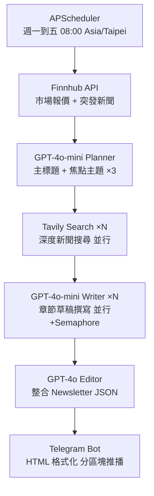

# 美股新聞編輯室 🗞️

全自動美股日報服務，**每週一至週五**定時透過 Telegram 推播，以多層 AI Agent 架構生成 Bloomberg/WSJ 風格的市場分析，專為部署在 Zeabur 所設計的企業級高可用架構。

---

## ✨ 核心特色

| 特色 | 說明 |
|------|------|
| 🤖 **多層 AI Agent** | Planner → Writer → Editor 三段式分工，品質遠優於單一 prompt |
| 🛡️ **高可用容錯** | Tenacity 自動重試 + Pydantic JSON 格式驗證，防止 AI 幻覺破壞流程 |
| 💰 **成本最佳化** | 規劃/撰寫使用 `gpt-4o-mini`，最終編輯才升級 `gpt-4o`，節省高達 80% API 費用 |
| ⚡ **並行加速** | 市場報價、Tavily 搜尋、章節撰寫全部 `asyncio.gather` 並行執行 |
| 🔒 **防護機制** | Semaphore 控制 OpenAI 並發上限、手動觸發冷卻 300 秒防刷 |
| 📱 **精緻 Telegram UI** | 視覺分隔線、Blockquote 層次、Inline 來源連結、隱藏式免責聲明 |

---

## 🏗️ 技術架構

```
┌─────────────────────────────────────────────────────────┐
│                     FastAPI Server                       │
│         APScheduler (週一~五 08:00 Asia/Taipei)          │
└──────────────────────────┬──────────────────────────────┘
                           │ 觸發
                           ▼
┌─────────────────────────────────────────────────────────┐
│                   Pipeline 協調層                        │
│                  pipeline.py                            │
└──┬──────────────────────────────────────────────────────┘
   │
   ├─ Step 1 ──▶ [並行] Finnhub 市場報價 + Finnhub 突發新聞
   │
   ├─ Step 2 ──▶ GPT-4o-mini Planner → 主標題 + 焦點主題 ×N
   │
   ├─ Step 3 ──▶ [並行] Tavily Deep Search × 焦點數量
   │
   ├─ Step 4 ──▶ [並行 / Semaphore=3] GPT-4o-mini Writer × 焦點數量
   │
   ├─ Step 5 ──▶ GPT-4o Editor → 整合 JSON + Pydantic 驗證
   │
   └─ Step 6 ──▶ Telegram HTML 格式化 → 分區塊安全推播
```



---

## 📁 專案結構

```
us-stock-newsletter/
├── main.py                  # FastAPI 入口、APScheduler 排程、API 端點
├── requirements.txt
├── .env.example
│
└── app/
    ├── config.py            # Pydantic Settings 環境變數驗證 + 全域常數
    ├── clients.py           # Singleton 客戶端（OpenAI / Telegram / httpx）
    ├── models.py            # Pydantic 資料模型（Newsletter / Section / Source）
    ├── pipeline.py          # 核心流程協調器
    ├── formatter.py         # Telegram HTML 格式化工具
    ├── sender.py            # Telegram 安全分段推播
    │
    ├── ai/
    │   ├── planner.py       # Step 2：規劃主標題與焦點主題
    │   ├── writer.py        # Step 4：依搜索結果撰寫章節草稿
    │   └── editor.py        # Step 5：整合輸出結構化 JSON
    │
    └── data/
        ├── finnhub.py       # Step 1：市場指數報價 + 突發新聞
        └── tavily.py        # Step 3：Tavily 深度新聞搜尋
```

---

## 🔄 完整工作流程

### Step 1 — 資料收集（並行）

`pipeline.py` 使用 `asyncio.gather` **同時**發出兩個請求：

- **`get_market_data()`**：對 Finnhub Quote API 並行取得 SPY / QQQ / DIA 三大指數即時報價（含漲跌幅 `dp`）
- **`get_finnhub_news()`**：取得最新 5 筆美股市場新聞（標題、摘要）

> 兩個請求都具備 Tenacity **最多重試 3 次**（指數退避 2–10 秒）的保護。

---

### Step 2 — AI 規劃主題（Planner）

`ai/planner.py` 將新聞摘要送給 **GPT-4o-mini**，輸出：

```json
{
  "title": "NVDA 財報超預期，AI 基建商機持續升溫",
  "topics": ["NVDA 財報分析", "AI 伺服器供應鏈", "Fed 利率影響科技股"]
}
```

結果透過 **Pydantic `NewsletterPlan`** 驗證，JSON 格式不符會直接觸發 retry。

---

### Step 3 — 深度搜尋（Tavily，並行）

`data/tavily.py` 針對每個焦點主題向 **Tavily Search API** 並行查詢，每個主題取 3 篇近期相關文章（標題 + URL + 原文節錄）。

若某個主題搜尋失敗，Pipeline 會跳過該主題並繼續，而不是整個流程崩潰。

---

### Step 4 — AI 章節撰寫（Writer，並行 + Semaphore）

`ai/writer.py` 以 **GPT-4o-mini** 為每個有效主題撰寫分析章節：

- 同時啟動所有 Writer（`asyncio.gather`）
- 以 `asyncio.Semaphore(3)` 限制最多同時 3 個 OpenAI 請求，避免 429 Rate Limit
- 輸出純文字草稿，股票代碼格式為 `【TICKER】`

---

### Step 5 — AI 最終編輯（Editor）

`ai/editor.py` 以 **GPT-4o** 將所有章節草稿整合為結構化 JSON：

```json
{
  "subject": "今日日報主旨（15字內）",
  "market_summary": "大盤情緒一句話摘要",
  "sections": [
    {
      "title": "章節標題",
      "body": "正文（純文字，股票代碼用【TICKER】）",
      "sources": [{"title": "來源標題", "url": "https://..."}]
    }
  ],
  "insights": "投資啟示與風險提醒（2-3句）"
}
```

透過 **Pydantic `Newsletter`** 嚴格驗證結構，最多重試 3 次（指數退避 3–15 秒）。

---

### Step 6 — Telegram 推播

`sender.py` + `formatter.py` 將 Newsletter 轉換為 Telegram HTML 訊息並推播：

1. **`build_header()`** — 視覺邊框 + 中英文雙語標題 + 日期
2. **`build_market_card()`** — 三大指數漲跌快照 + 市場情緒短評
3. **`build_section_block()`** × N — 標題 + Blockquote 正文 + 來源連結
4. **`build_footer()`** — 投資啟示 + 隱藏式免責聲明（`<tg-spoiler>`）

每個區塊獨立發送，超過 4000 字元時在 `\n\n` 段落邊界切割，每區塊間隔 0.5 秒防止 Rate Limit（429）。

**錯誤告警**：任一步驟嚴重失敗，Pipeline 會自動推播錯誤訊息到 Telegram 頻道。

---

## 🚀 部署到 Zeabur

1. Fork 此 repo
2. 登入 [Zeabur](https://zeabur.com) → New Project → Deploy from GitHub
3. 在 Variables 設定以下環境變數：

| 變數 | 必填 | 預設值 | 說明 | 取得方式 |
|------|:---:|--------|------|---------|
| `OPENAI_API_KEY` | ✅ | — | OpenAI API Key | [platform.openai.com](https://platform.openai.com) |
| `FINNHUB_API_KEY` | ✅ | — | Finnhub API Key | [finnhub.io](https://finnhub.io) |
| `TAVILY_API_KEY` | ✅ | — | Tavily API Key | [tavily.com](https://tavily.com) |
| `TELEGRAM_TOKEN` | ✅ | — | Telegram Bot Token | `@BotFather` |
| `TELEGRAM_CHAT_ID` | ✅ | — | 頻道/群組 ID | `@userinfobot` 或 `@getidsbot` |
| `CRON_HOUR` | | `8` | 觸發小時 | — |
| `CRON_MINUTE` | | `0` | 觸發分鐘 | — |
| `TIMEZONE` | | `Asia/Taipei` | 時區 | — |
| `ADMIN_API_KEY` | | `""` | 手動觸發保護金鑰 | 自行設定高強度隨機字串 |

> ⚠️ 系統在**啟動時**即驗證所有必填變數，缺少任何 Key 服務會立即報錯，防止在運行途中才隱晦失敗。

---

## 🕹️ API 端點

### `GET /` — 健康檢查

```bash
curl https://你的服務.zeabur.app/
```

```json
{
  "status": "ok",
  "service": "美股新聞編輯室",
  "next_run": "2026-03-12 08:00:00+08:00"
}
```

### `POST /run` — 手動觸發

```bash
# 設定了 ADMIN_API_KEY
curl -X POST https://你的服務.zeabur.app/run \
  -H "authorization: 你的ADMIN_API_KEY"

# 未設定 ADMIN_API_KEY
curl -X POST https://你的服務.zeabur.app/run
```

> 觸發後立即回傳，日報流程在背景非同步執行。每次觸發間隔至少 **300 秒**，過於頻繁回傳 HTTP 429。

---

## 💻 本地開發

```bash
# 1. 建立虛擬環境
python3 -m venv .venv
source .venv/bin/activate   # Windows: .venv\Scripts\activate

# 2. 安裝套件
pip install -r requirements.txt

# 3. 設定環境變數
cp .env.example .env
# 編輯 .env 填入各 API Key

# 4. 執行單元測試
pytest tests/

# 5. 啟動服務（支援熱重載）
uvicorn main:app --reload
```

---

## 🔧 已完成的優化記錄

| 版本 | 項目 | 說明 |
|------|------|------|
| v1 | HTML 切割安全修復 | 遞迴式切割改為迭代式，消除潛在 Stack Overflow 風險 |
| v1 | OpenAI 並發保護 | 加入 `Semaphore(3)` 防止 Writer 並行時打爆 Rate Limit |
| v1 | 錯誤告警推播 | Pipeline 任何嚴重失敗自動推播 Telegram 錯誤通知 |
| v2 | Telegram UX/UI 精進 | 加入視覺分隔線 `━`、中英雙語標題、消息來源換行 Bug 修正 |
| v2 | `reraise` 語意修正 | `finnhub.py` 移除與手動 `raise` 衝突的 `reraise=False` |
| v2 | 截斷長度統一 | 修正 `>15` 截 14 的邏輯矛盾，統一截至 15 字元 |
| v2 | config 說明修正 | 移除 `cron_hour` description 中已過時的「美東時間」說明 |

---

## 🚧 未來可優化項目

### 功能擴充

- [ ] **更多市場指數**：加入 VIX 恐慌指數、原油、黃金、比特幣，豐富大盤快照內容
- [ ] **多頻道支援**：允許設定多個 `TELEGRAM_CHAT_ID`，同時推播至多個群組或頻道
- [ ] **歷史對比**：記錄每日大盤數據，快照中加入「前日對比 / 週漲跌」欄位
- [ ] **市場情緒指數**：基於新聞語調與大盤走勢計算量化情緒分數（如 -5 到 +5），以圖示呈現

### AI 品質提升

- [ ] **新聞去重機制**：記錄已報導主題（Redis 或本地 JSON），避免連續多日重複同一話題
- [ ] **動態章節數量**：根據新聞豐富度彈性調整章節數（目前固定 3 個）
- [ ] **圖片卡片生成**：使用 DALL-E 或 Matplotlib 生成大盤走勢圖，透過 `sendPhoto` 推播
- [ ] **Writer 輸出結構化**：Writer 直接輸出 `Section` Pydantic 物件，省去 Editor 重新解析文字的成本

### 穩定性與效能

- [ ] **HTML 切割安全強化**：目前依 `\n\n` 切割，若 AI 產出無雙換行會硬切 HTML 標籤；改用解析器確保標籤完整性
- [ ] **`tavily.py` reraise 修正**：仍有 `reraise=False` 與手動 `raise` 並用，應統一移除（同 v2 已修正的 finnhub.py）
- [ ] **Redis 快取**：快取 Finnhub 市場數據，在重試或多次手動觸發時避免重複打 API
- [ ] **部分成功策略**：若 Editor JSON 驗證失敗，降級合併 Writer 草稿直接推播，而非整個流程報錯

### 可觀測性

- [ ] **結構化日誌**：改用 `structlog` 輸出 JSON 格式 Log，方便在 Zeabur 上過濾與查詢
- [ ] **執行時間追蹤**：記錄每個 Step 的耗時，識別效能瓶頸
- [ ] **OpenTelemetry 整合**：接入分散式追蹤，監控 AI API 呼叫延遲與成功率

### 部署與維運

- [ ] **Zeabur Cron Job**：改用 Zeabur 原生 Cron Job 取代 APScheduler，更適合無狀態容器環境
- [ ] **多平台推播**：擴充支援 Discord Webhook、LINE Notify、Slack Bot
- [ ] **GitHub Actions CI**：加入 PR 自動跑 `pytest` + `ruff` 靜態分析的 CI 流程
- [ ] **Docker Compose 本地環境**：提供含 Redis 模擬的完整本地開發環境設定
