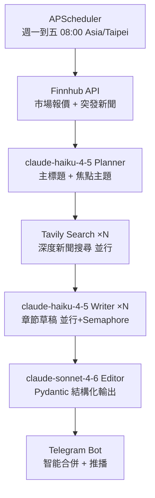

# 美股新聞編輯室 🗞️

全自動美股日報服務，**每週一至週五**早上 8:00（Asia/Taipei）定時透過 Telegram 推播。以多層 AI Agent 架構生成 Bloomberg/WSJ 風格的市場分析報告，部署於 Zeabur 雲端平台。

---

## ✨ 核心特色

| 特色 | 說明 |
|------|------|
| 🤖 **多層 AI Agent** | Planner → Writer → Editor 三段式分工，品質遠優於單一 prompt |
| 🧠 **ai-hedge-fund 整合** | 內嵌 [virattt/ai-hedge-fund](https://github.com/virattt/ai-hedge-fund) 為分析大腦，Buffett / 基本面 / 技術面 / 情緒多位 AI 分析師同步給出個股 signal |
| 📋 **watchlist.json** | 自選股清單放在 repo，於 GitHub 網頁直接編輯即可更新，Zeabur webhook 自動重新部署 |
| 🛡️ **高可用容錯** | Tenacity 自動重試 + Pydantic JSON 格式驗證 + hedge fund adapter 降級機制，防止 AI 幻覺破壞流程 |
| 💰 **成本最佳化** | 規劃/撰寫用 `claude-haiku-4-6`，最終編輯升級 `claude-sonnet-4-6`，節省大量 API 費用 |
| ⚡ **並行加速** | 市場報價、Tavily 搜尋、章節撰寫、個股分析全部 `asyncio.gather` 並行執行 |
| 🔒 **防護機制** | Semaphore 控制並發上限、手動觸發冷卻 300 秒防刷 |
| 📱 **精緻 Telegram UI** | 智能訊息合併、章節進度編號、個股共識卡片、Blockquote 層次、隱藏式免責聲明 |

---

## 🏗️ 技術架構

```
┌─────────────────────────────────────────────────────────┐
│                     FastAPI Server                       │
│         APScheduler（週一~五 08:00 Asia/Taipei）          │
└──────────────────────────┬──────────────────────────────┘
                           │ 觸發
                           ▼
┌─────────────────────────────────────────────────────────┐
│              Pipeline 協調層（pipeline.py）               │
└──┬──────────────────────────────────────────────────────┘
   │
   ├─ Step 1 ──▶ 【並行】Finnhub 市場報價 + Finnhub 突發新聞
   │
   ├─ Step 2 ──▶ claude-haiku-4-5 Planner → 主標題 + 焦點主題
   │
   ├─ Step 3 ──▶ 【並行】Tavily Deep Search × 焦點數量
   │
   ├─ Step 4 ──▶ 【並行 Semaphore=3】claude-haiku-4-5 Writer × 焦點數量
   │
   ├─ Step 5 ──▶ claude-sonnet-4-6 Editor → 整合 + Pydantic 結構化輸出
   │
   └─ Step 6 ──▶ Telegram 格式化 → 智能合併 → 推播
```



---

## 📁 專案結構

```
us-stock-newsletter/
├── main.py                  # FastAPI 入口、APScheduler 排程、API 端點
├── requirements.txt         # Python 依賴清單
├── .env.example             # 環境變數範本
├── tests/
│   ├── test_formatter.py    # 格式化函式測試（7 項）
│   └── test_merge_blocks.py # 訊息合併邏輯測試（5 項）
│
└── app/
    ├── config.py            # Pydantic Settings 環境變數驗證 + 全域常數
    ├── clients.py           # Singleton 客戶端（OpenAI / Telegram / httpx）
    ├── models.py            # Pydantic 資料模型（Newsletter / Section / Source）
    ├── pipeline.py          # 核心流程協調器（6 步驟串接）
    ├── formatter.py         # Telegram HTML 格式化工具
    ├── sender.py            # Telegram 智能合併 + 安全推播
    │
    ├── ai/
    │   ├── planner.py       # Step 2：GPT-4o-mini 規劃主標題與焦點主題
    │   ├── writer.py        # Step 4：GPT-4o-mini 撰寫章節草稿
    │   └── editor.py        # Step 5：GPT-4o 整合輸出結構化 JSON
    │
    └── data/
        ├── finnhub.py       # Step 1：Finnhub 市場指數報價 + 突發新聞
        └── tavily.py        # Step 3：Tavily 深度新聞搜尋
```

---

## 🔄 完整工作流程

### Step 1 — 資料收集（並行）

`pipeline.py` 使用 `asyncio.gather` **同時**發出兩個請求：

- **`get_market_data()`**：並行取得 SPY / QQQ / DIA 三大指數即時報價與漲跌幅
- **`get_finnhub_news()`**：取得最新 5 筆美股市場新聞

> 兩個請求皆具備 Tenacity 最多重試 3 次（指數退避 2–10 秒）。若個別指數報價失敗，以預設值 `{price: 0, change: 0}` 降級處理，不中斷流程。

### Step 2 — AI 規劃主題（Planner）

`ai/planner.py` 將新聞摘要送給 **claude-haiku-4-5**，輸出：

```json
{
  "title": "NVDA 財報超預期，AI 基建商機持續升溫",
  "topics": ["NVDA 財報分析", "AI 伺服器供應鏈", "Fed 利率影響科技股"]
}
```

透過 `messages.parse()` 直接回傳 **Pydantic `NewsletterPlan`** 物件，無需手動解析 JSON。

### Step 3 — 深度搜尋（Tavily，並行）

`data/tavily.py` 針對每個焦點主題向 **Tavily Search API** 並行查詢，每個主題取 3 篇相關文章（標題 + URL + 摘要）。

若某個主題搜尋失敗，Pipeline 跳過該主題繼續，不中斷整體流程。

### Step 4 — AI 章節撰寫（Writer，並行 + Semaphore）

`ai/writer.py` 以 **claude-haiku-4-5** 為每個有效主題撰寫分析章節：

- `asyncio.gather` 並行啟動所有 Writer
- `asyncio.Semaphore(3)` 限制同時最多 3 個 OpenAI 請求，避免 429
- 輸出純文字草稿，股票代碼以 `【TICKER】` 標記

### Step 5 — AI 最終編輯（Editor）

`ai/editor.py` 以 **claude-sonnet-4-6** 將章節草稿整合為結構化輸出：

```json
{
  "subject": "今日主旨（15字內）",
  "market_summary": "大盤情緒一句話摘要",
  "sections": [
    {
      "title": "章節標題",
      "body": "正文（純文字，股票代碼用【TICKER】）",
      "sources": [{"title": "來源標題", "url": "https://..."}]
    }
  ],
  "insights": "投資啟示與風險提醒（2-3句）"
}
```

透過 `messages.parse()` 直接回傳 **Pydantic `Newsletter`** 物件，最多重試 3 次（指數退避 3–15 秒）。

### Step 6 — Telegram 推播（智能合併）

`sender.py` + `formatter.py` 組裝 HTML 訊息：

1. **`build_header()`** — 精簡單行標題 + 日期
2. **`build_market_card()`** — 三大指數漲跌快照 + 市場短評
3. **`build_section_block()`** × N — 帶進度編號 `[1/3]` 的章節 + 來源連結
4. **`build_footer()`** — 投資啟示 + 隱藏式免責聲明（`<tg-spoiler>`）

**智能合併**：`_merge_blocks()` 將相鄰區塊自動合併，6 個區塊壓縮至 2-3 則訊息，大幅減少通知數量。超過 4000 字元時在 `\n\n` 段落邊界安全切割。

**錯誤告警**：任一步驟嚴重失敗，Pipeline 自動推播 HTML-escaped 錯誤訊息到 Telegram。

---

## 📋 自選股管理（watchlist.json）

個股分析清單放在 repo 根目錄的 `watchlist.json`：

```json
{
  "tickers": ["AAPL", "MSFT", "NVDA", "GOOGL", "TSLA"],
  "notes": "免費清單，不需 FINANCIAL_DATASETS_API_KEY"
}
```

### 如何更新

1. 於 GitHub 網頁直接打開 `watchlist.json` → 點鉛筆圖示編輯 → commit 到 `main`
2. Zeabur 會自動偵測 push 並重新部署
3. 下一次排程（或手動 `/run`）就會以新清單跑 AI 多分析師

### 規則

- ticker 格式：**大寫英文字母 / 數字 / `.` / `-`**，長度 1–10
- 重複會去重、無效會被過濾
- **硬上限 10 檔**（防止 LLM 成本爆炸）
- 清單為空或檔案壞掉會自動 fallback 到 `DEFAULT_WATCHLIST = [AAPL, MSFT, NVDA, GOOGL, TSLA]` 並記 log
- 預設清單完全落在 Financial Datasets **免費層**，不需付費 key；若加入 META / AMZN / AMD / TSM 等，請於 Zeabur 新增 `FINANCIAL_DATASETS_API_KEY`

---

## 🚀 部署到 Zeabur

1. Fork 此 repo
2. 登入 [Zeabur](https://zeabur.com) → New Project → Deploy from GitHub
3. **⚠️ 啟用 Submodule Clone**：Service → Settings → Source → 勾選 "Clone Submodules"（或於 `.zeabur/config.yaml` 設定），讓 Zeabur 在 build 階段自動 checkout `vendor/ai_hedge_fund`
4. 在 Variables 設定以下環境變數：

| 變數 | 必填 | 預設值 | 說明 | 取得方式 |
|------|:---:|--------|------|---------|
| `ANTHROPIC_API_KEY` | ✅ | — | Anthropic API Key | [console.anthropic.com](https://console.anthropic.com) |
| `FINNHUB_API_KEY` | ✅ | — | Finnhub API Key | [finnhub.io](https://finnhub.io) |
| `TAVILY_API_KEY` | ✅ | — | Tavily API Key | [tavily.com](https://tavily.com) |
| `TELEGRAM_TOKEN` | ✅ | — | Telegram Bot Token | `@BotFather` |
| `TELEGRAM_CHAT_ID` | ✅ | — | 頻道/群組 ID | `@userinfobot` 或 `@getidsbot` |
| `CRON_HOUR` | | `8` | 排程觸發小時 | — |
| `CRON_MINUTE` | | `0` | 排程觸發分鐘 | — |
| `TIMEZONE` | | `Asia/Taipei` | 時區 | — |
| `ADMIN_API_KEY` | | `""` | 手動觸發保護金鑰 | 自行設定高強度隨機字串 |
| `FINANCIAL_DATASETS_API_KEY` | | `""` | ai-hedge-fund 個股數據源；免費清單不需要 | [financialdatasets.ai](https://financialdatasets.ai) |
| `HEDGE_FUND_ANALYSTS` | | `warren_buffett,fundamentals_analyst,technical_analyst,sentiment_analyst` | 啟用的 AI 分析師（逗號分隔，亦接受短別名 fundamentals/technicals/sentiment） | — |
| `HEDGE_FUND_MODEL` | | `claude-haiku-4-6` | ai-hedge-fund 內部用的 Claude 模型 | — |
| `HEDGE_FUND_TIMEOUT` | | `240` | 整輪個股分析超時秒數 | — |

> ⚠️ 系統在**啟動時**即驗證所有必填變數，缺少任何 Key 服務會立即報錯，不會在運行途中才隱晦失敗。
> ⚠️ `ANTHROPIC_API_KEY` 會**同時**被主 pipeline 與 ai-hedge-fund 使用，不需要額外 OpenAI key。

---

## 🕹️ API 端點

### `GET /` — 健康檢查

```bash
curl https://your-service.zeabur.app/
```

```json
{
  "status": "ok",
  "service": "美股新聞編輯室",
  "next_run": "2026-03-13 08:00:00+08:00"
}
```

### `POST /run` — 手動觸發

```bash
# 設定了 ADMIN_API_KEY
curl -X POST https://your-service.zeabur.app/run \
  -H "authorization: your-admin-key"

# 未設定 ADMIN_API_KEY
curl -X POST https://your-service.zeabur.app/run
```

> 觸發後立即回傳，日報流程在背景非同步執行。每次觸發間隔至少 **300 秒**，過於頻繁回傳 HTTP 429。

---

## 💻 本地開發

```bash
# 0. Clone 時一定要帶 --recurse-submodules 才會抓到 vendor/ai_hedge_fund
git clone --recurse-submodules https://github.com/jack926509/us-stock-newsletter.git
cd us-stock-newsletter
# 已經 clone 過但沒有 submodule：
# git submodule update --init --recursive

# 1. 建立虛擬環境
python3 -m venv .venv
source .venv/bin/activate   # Windows: .venv\Scripts\activate

# 2. 安裝套件（會同時裝 langgraph / langchain / langchain-anthropic 供 ai-hedge-fund 用）
pip install -r requirements.txt

# 3. 設定環境變數
cp .env.example .env
# 編輯 .env 填入各 API Key

# 4. 執行單元測試（32 項）
pytest tests/ -v

# 5. 啟動服務
uvicorn main:app --reload
```

---

## 🔧 優化修改記錄

### v1 — 基礎架構

| 項目 | 說明 |
|------|------|
| HTML 切割安全修復 | 遞迴式切割改為迭代式，消除 Stack Overflow 風險 |
| OpenAI 並發保護 | 加入 `Semaphore(3)` 防止 Writer 並行觸發 429 |
| 錯誤告警推播 | Pipeline 嚴重失敗時自動推播 Telegram 錯誤通知 |

### v2 — Telegram UX 初版 + Bug 修復

| 項目 | 說明 |
|------|------|
| 視覺分隔線 | Header 加入 `━` 分隔線，中英雙語標題 |
| 消息來源換行修復 | 來源連結直接黏在 `</blockquote>` 後的 Bug，加入 `\n` 分隔 |
| `reraise` 語意修正 | `finnhub.py` 移除與手動 `raise` 衝突的 `reraise=False` |
| 截斷長度統一 | 修正來源標題 `>15` 截 14 的邏輯矛盾 |
| config 說明修正 | `cron_hour` description 移除已過時的「美東時間」 |

### v3 — 全面程式碼品質修復（8 項）

| 項目 | 說明 |
|------|------|
| `tavily.py` reraise 修正 | 移除 `reraise=False` 與手動 `raise` 的語意衝突 |
| 測試格式修正 | `test_formatter.py` 日期斷言配合新的 `%Y/%m/%d` 格式 |
| `.env.example` 同步 | 預設值更新為 `CRON_HOUR=8`、`TIMEZONE=Asia/Taipei` |
| 錯誤告警 HTML 注入修復 | `pipeline.py` 的 `str(e)` 加入 `escape_html()` 防止 HTML 注入 |
| 未使用 import 清理 | `planner.py` 移除未使用的 `import json` |
| 背景 Task GC 修復 | `main.py` 儲存 `create_task()` 引用至 `_background_tasks` set，防止 GC 回收 |
| 過時註解清理 | `main.py` 移除「新寫好的模組引用」過時註解 |
| Tavily 頻寬節省 | `include_raw_content` 改為 `False`，Writer 未使用完整原文 |

### v5 — Anthropic API 遷移（本次）

| 項目 | 說明 |
|------|------|
| AI 供應商切換 | `openai` → `anthropic`，`AsyncOpenAI` → `AsyncAnthropic` |
| 模型升級 | `gpt-4o-mini` → `claude-haiku-4-5`（Planner + Writer）；`gpt-4o` → `claude-sonnet-4-6`（Editor） |
| 結構化輸出簡化 | `response_format={"type":"json_object"}` + 手動 `model_validate_json()` → `messages.parse(output_format=PydanticModel)`，直接回傳 Pydantic 物件 |
| Timeout 集中管理 | 各 call 分散的 `timeout=` 改為在 `AsyncAnthropic(timeout=90.0)` 統一設定 |
| 錯誤鏈保留 | Writer/Editor 的 `raise ... from e` 保留原始例外鏈，方便追查根因 |
| ValidationError 移除 | `messages.parse()` 內建驗證，planner/editor 不再需要 `except ValidationError` 分支 |
| 環境變數 | `OPENAI_API_KEY` → `ANTHROPIC_API_KEY` |

### v4 — Telegram UX 重構

| 項目 | 說明 |
|------|------|
| 智能訊息合併 | 新增 `_merge_blocks()` 將 6 個區塊合併為 2-3 則訊息，大幅降低通知轟炸 |
| Header 精簡化 | 雙分隔線 5 行 → 單行 `📰 美股日報 ── 日期` 僅 2 行，手機端節省 60% 垂直空間 |
| 章節進度編號 | 標題加入 `[1/3]` `[2/3]` `[3/3]`，讀者掌握閱讀位置 |
| 來源截斷上限提升 | 15 → 30 字元，保留更多標題語義 |
| 測試覆蓋擴充 | 4 項 → 12 項（新增 section、market card、merge 合併邏輯測試） |

---

## 🚧 未來可優化項目

### 功能擴充

- [ ] **更多市場指數**：加入 VIX 恐慌指數、原油（WTI）、黃金、比特幣，豐富大盤快照
- [ ] **多頻道支援**：允許設定多個 `TELEGRAM_CHAT_ID`，同時推播至多個群組或頻道
- [ ] **歷史對比**：記錄每日大盤數據，快照中加入「前日對比 / 週漲跌」欄位
- [ ] **市場情緒指數**：基於新聞語調與大盤走勢計算量化情緒分數（-5 到 +5），以圖示呈現

### AI 品質提升

- [ ] **新聞去重機制**：記錄已報導主題（Redis 或本地 JSON），避免連續多日重複同一話題
- [ ] **動態章節數量**：根據新聞豐富度彈性調整章節數（目前固定 3 個）
- [ ] **圖片卡片生成**：使用 DALL-E 或 Matplotlib 生成大盤走勢圖，透過 `sendPhoto` 推播
- [ ] **Writer 輸出結構化**：Writer 直接輸出 `Section` Pydantic 物件，省去 Editor 重新解析的成本

### 穩定性與效能

- [ ] **HTML 切割安全強化**：目前依 `\n\n` 切割，若 AI 產出無雙換行會硬切 HTML 標籤；改用解析器確保標籤完整性
- [ ] **Redis 快取**：快取 Finnhub 市場數據，重試或多次手動觸發時避免重複打 API
- [ ] **部分成功策略**：若 Editor JSON 驗證失敗，降級合併 Writer 草稿直接推播，不中斷整個流程
- [ ] **排程失敗自動重試**：若當日 Pipeline 失敗，自動在 30 分鐘後重試一次

### 可觀測性

- [ ] **結構化日誌**：改用 `structlog` 輸出 JSON 格式 Log，方便在 Zeabur 上過濾查詢
- [ ] **執行時間追蹤**：記錄每個 Step 的耗時，識別效能瓶頸
- [ ] **OpenTelemetry 整合**：接入分散式追蹤，監控 AI API 呼叫延遲與成功率

### 部署與維運

- [ ] **Zeabur Cron Job**：改用 Zeabur 原生 Cron Job 取代 APScheduler，更適合無狀態容器
- [ ] **多平台推播**：擴充支援 Discord Webhook、LINE Notify、Slack Bot
- [ ] **GitHub Actions CI**：PR 自動跑 `pytest` + `ruff` 靜態分析
- [ ] **Docker Compose 本地環境**：提供含 Redis 的完整本地開發環境設定
