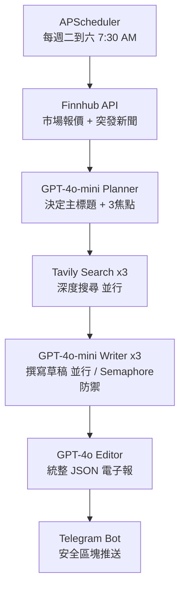

# 美股新聞編輯室 🗞️

自動化美股日報服務，**每週一至週五**定時透過 Telegram 發送，專為部署在 Zeabur 所設計的企業級高可用架構。

## ✨ 核心特色

- 🤖 **多層 AI Agent 架構**：自動整合新聞、規劃主題、深度搜尋、撰寫與編輯排版。
- 🛡️ **高可用與容錯**：內建網路錯誤自動重試 (Tenacity)、AI 幻覺與 JSON 格式自我修復 (Pydantic)。
- 💰 **成本最佳化**：策略性使用 `gpt-4o-mini` 處理常規任務，並以 `gpt-4o` 進行最終編輯排版，節省高達 80% 的 API 費用。
- ⏳ **防禦機制**：設有 OpenAI 流量併發管裡 (Semaphore) 以及 webhook 端點的觸發冷卻防護。
- 📱 **高級 UI 體驗**：深度客製化 Telegram HTML 格式，使用 Blockquotes、Inline Links 及隱藏式免責聲明。

## 🏗️ 技術架構



## 🚀 部署到 Zeabur

1. Fork 此 repo
2. 登入 [Zeabur](https://zeabur.com) → New Project → Deploy from GitHub
3. 在 Variables 設定環境變數：

| 變數 | 必填 | 說明 | 取得方式 |
|------|:---:|------|---------|
| `OPENAI_API_KEY` | ✅ | OpenAI API Key | https://platform.openai.com |
| `FINNHUB_API_KEY`| ✅ | Finnhub API Key | https://finnhub.io |
| `TAVILY_API_KEY` | ✅ | Tavily API Key | https://tavily.com |
| `TELEGRAM_TOKEN` | ✅ | Telegram Bot Token | @BotFather |
| `TELEGRAM_CHAT_ID`| ✅ | 頻道/群組 ID | @userinfobot 或 @getidsbot |
| `CRON_HOUR` | | 觸發小時 (預設 7) | - |
| `CRON_MINUTE` | | 觸發分鐘 (預設 30) | - |
| `TIMEZONE` | | 時區 (預設 America/New_York) | - |
| `ADMIN_API_KEY` | | 手動觸發的金鑰防護 | 自行設定一個高強度隨機字串 |

> ⚠️ 注意：系統具備啟動驗證功能，如果漏填必填的環境變數，服務會在啟動瞬間直接報錯防止死機。

## 🕹️ 手動觸發測試

當服務運行起來後，可以手動觸發流程（包含 5 分鐘冷卻機制）：

```bash
# 如果有設定 ADMIN_API_KEY
curl -X POST https://你的服務.zeabur.app/run \
  -H "authorization: 你的ADMIN_API_KEY"

# 如果未設定 ADMIN_API_KEY
curl -X POST https://你的服務.zeabur.app/run
```

## 💻 本地測試與開發

1. 安裝套件：
```bash
python3 -m venv .venv
source .venv/bin/activate
pip install -r requirements.txt
```

2. 複製設定檔並填寫 Key：
```bash
cp .env.example .env
```

3. 執行單元測試：
```bash
pytest tests/
```

4. 啟動服務：
```bash
uvicorn main:app --reload
```
